<h1 align="center">☕ Amante's Coffee: Automated Supabase Cloud ETL Pipeline</h1>

  

  
  
  
  
  
  

## 📌 Project Overview
This repository contains a fully automated, cloud-native ETL (Extract, Transform, Load) pipeline built for a retail food and beverage business. 

The pipeline extracts raw daily Point of Sale (POS) Excel reports from Google Drive, performs complex data cleaning and dimensional modeling using Pandas, and loads the structured data into a Supabase (PostgreSQL) database. The database serves as the single source of truth for dynamic Power BI dashboards.

> **Portfolio Note:** This project was intentionally upgraded from a local flat-file (CSV) architecture to a fully cloud-based relational database architecture to handle increased data volume, ensure concurrent read/write stability, and demonstrate modern cloud engineering practices.

## 🎯 The Problem It Solves

Before this pipeline, the business faced three major analytical bottlenecks:

1. **❌ Manual Toil:** Daily sales reports had to be manually downloaded from Google Drive, cleaned in Excel, and appended to a master spreadsheet. 
2. **❌ Unusable POS Data:** The POS system exported entire customer orders as a single, comma-separated text string (e.g., `"1x Solo Hot Spanish Latte, 2x Croffle - Biscoff"`). This made it impossible to track individual item profitability, flavor popularity, or add-on conversion rates.
3. **❌ Fragile Architecture:** Relying on a flat `.csv` file as the backend for Power BI dashboards caused file-lock errors, slow refresh times, and data corruption risks as the business scaled.

### ✅ The Automated Solution
This ETL pipeline completely removes the human element from data prep. It automatically intercepts the raw Excel file, explodes the nested text strings into granular line items, extracts complex categorical features (like sugar levels and flavors) using Regex, totally cleans the dataset, and loads it into a **Supabase PostgreSQL database**. 

**The result:** The business owners now have a zero-maintenance, highly relational database that feeds real-time Power BI dashboards, allowing them to instantly see which specific menu items drive the most revenue.

---

## 🏗️ Data Architecture & Workflow

```mermaid
graph TD
    %% Nodes
    POS(POS System Email)
    GAS(Google Apps Script <br/> ⏰ 1:00 AM)
    
    subgraph Google_Drive [Google Drive Storage]
        RAW[📂 raw_pos_reports <br/> Staging Area]
        ARCHIVE_POS_REPORTS[📂 archived_pos_reports <br/> Archive History]
        MASTER_REPORT_FILE[📊 fact_sales2026<br/> Supabase Database]
    end
    
    subgraph GitHub_Cloud [GitHub Actions Cloud]
        PY(Python Automation <br/> Clean & Transform <br/> ⏰ 1:30 AM)
        SECRET[🔒 GCP Service Key <br/> Base64 Encoded Secret]
    end
    
    PBI(Power BI Dashboard <br/> 🔄 Auto-Refresh)
    
    %% Connections
    POS -->|Attachment| GAS
    GAS -->|Save File| RAW
    
    RAW -->|Read Data| PY
    SECRET -.->|Authenticate| PY
    
    PY -->|Load Data| MASTER_REPORT_FILE
    PY -->|Move File| ARCHIVE_POS_REPORTS
    
    MASTER_REPORT_FILE -->|Import Data| PBI
    
    %% Styling
    style PY fill:#1F1F1F,stroke:#333,stroke-width:2px
    style MASTER_REPORT_FILE fill:#1F1F1F,stroke:#333,stroke-width:2px
    style SECRET fill:#fff,stroke:#f00,stroke-width:2px,stroke-dasharray: 5 5
```

1. **Extract:** A Python script authenticates with the Google Drive API using securely decoded service accounts to locate and download new daily POS reports (`.xlsx`).
2. **Transform:** Data is passed through a robust Pandas cleaning pipeline (details below) to normalize nested data structures and enforce strict data types.
3. **Load:** Cleaned records are converted to JSON and pushed to a Supabase PostgreSQL table (`fact_sales2026`). 
4. **Archive:** Processed files are automatically moved to an archive folder in Google Drive to prevent duplicate processing.
5. **Analyze:** Power BI connects directly to the Supabase database via DirectQuery/Import for real-time business intelligence.

---

## 🛠️ Key Data Transformations (Pandas)
The raw POS data is highly denormalized and contains human-input errors. The Python script handles several critical transformations:

* **List Explosion & Normalization:** The POS system groups entire orders into a single comma-separated text string. The pipeline uses `.explode()` to split these strings into individual granular line items for accurate item-level profitability tracking.
* **Regex Feature Extraction:** Uses Regular Expressions (`re`) to dynamically extract attributes hidden within text strings, creating dedicated columns for:
  * `Size` (e.g., Solo, Familia)
  * `Variation` (Hot/Cold)
  * `Flavor` (e.g., Cheese, Sour Cream, BBQ)
  * `Sugar & Spice Levels`
* **Data Type Enforcement & Cleansing:** * Safely strips thousand-separator commas from financial strings (e.g., `"1,192.00"`) and coerces them into operational float types.
  * Handles `NaN` and `Infinity` float anomalies before database ingestion to prevent SQL mapping errors.
* **Categorical Mapping:** Maps over 100 distinct raw items into standardized `Sub-Category` and `Category` hierarchies using predefined dictionary logic.

---

## ⚙️ CI/CD & Automation
This pipeline requires zero manual intervention. It is deployed and orchestrated using **GitHub Actions**.

* **Trigger:** Configured to run automatically via a CRON schedule (daily at 1:30AM) or manually via `workflow_dispatch`. *(Note: Scheduled runs are currently disabled for this static portfolio showcase).*
* **Environment:** Runs on a virtual `ubuntu-latest` runner.
* **Security:** * API keys and Supabase credentials are obfuscated using GitHub Secrets.
  * Google Cloud credentials are securely injected at runtime by passing a Base64-encoded string into the environment and decoding it via a Python one-liner, completely avoiding raw JSON file uploads to the repository.
